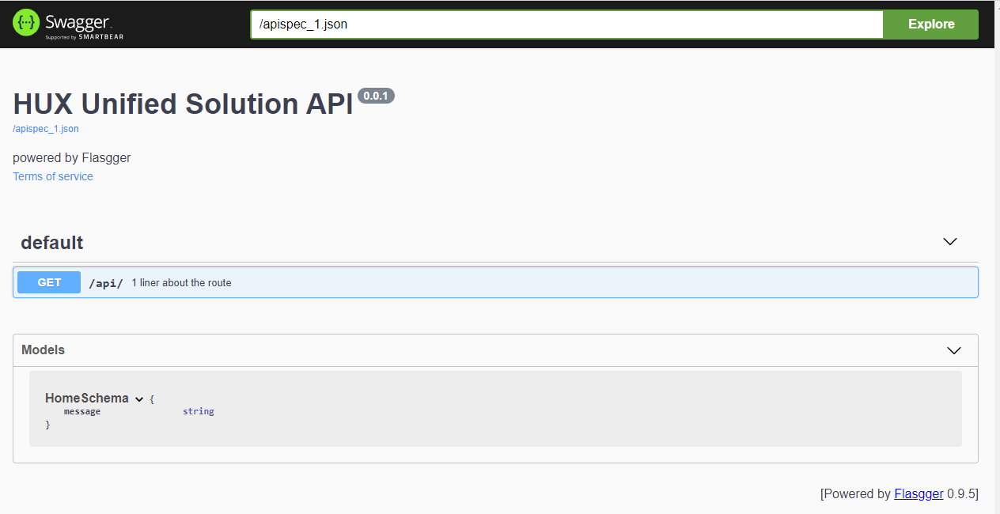

# HUX Unified Solution Server-Side

Information the Server Side Flask Project

## Installation

### Software Dependencies

Python Version
* Python 3.7

Install Requirements
```
pipenv install
```

#### Flasgger
Flasgger is a Flask extension to **extract [OpenAPI-Specification](https://github.com/OAI/OpenAPI-Specification/blob/master/versions/2.0.md#operation-object)** 
from all Flask views registered in your API.

Flasgger also comes with **[SwaggerUI](http://swagger.io/swagger-ui/) embedded** so you can access [http://localhost:5000/apidocs](localhost:5000/apidocs) 
and visualize and interact with your API resources.

#### flask-marshmallow

Flask-Marshmallow is a thin integration layer for **[Flask](http://flask.pocoo.org/)** (a Python web framework) 
and **[marshmallow](http://marshmallow.readthedocs.io/)** (an object serialization/deserialization library) 
that adds additional features to marshmallow, including URL and Hyperlinks fields for HATEOAS-ready APIs. 
It also (optionally) integrates with **[Flask-SQLAlchemy](http://marshmallow.readthedocs.io/)**.

#### Moto
Moto is a library that allows your tests to easily mock out AWS Services.

#### apispec

apispec is a pluggable API specification generator. Currently, supports the **extract [OpenAPI-Specification](https://github.com/OAI/OpenAPI-Specification/blob/master/versions/2.0.md#operation-object)**

### Dev


### Makefile


### Prerequisites

## Usage

### HuxUnify

Start the API
```
pipenv run python -m flask run
```

For viewing the API Documentation, simply go to the following URL
.../apidocs



### Style Guide
PEP8

Google Python Docstrings
https://sphinxcontrib-napoleon.readthedocs.io/en/latest/example_google.html

### Test
```
pipenv run python -m unittest
```


### Data

### Search

### Web interface

### Evaluation

[comment]: <> (You will need assessments log file, obtained from server.  )

## Report

## License

Private