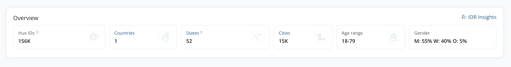

=============================================
Customer Insights
=============================================

This page is intended to highlight different aspects and types of insights we derive from customer data in Huxunify.

Customer insights sheds light on the behavioral pattern of different customers. It gives a graphical representation of
the analysis of all customer data which proves to be intuitive and factual.

Customer Overview
------------------------
This section shows the overall distribution of the customer base on the basis of countries, states, cities, age
and gender.

Hovering over each card gives the exact value of each.

Insights Overview
-------------------
Customer insights overview houses different graphs representing distribution of customer
and growth of the customer base.

Customer Count: Graph represents how and at what rate the customer base changes

Customer Spends: Graph shows how the average spend of customers have been in the recent past.

.. image:: static/img/customer_insights/customer_spends.png
    :width: 500

Demographic Distribution: Graph showcases the distribution of customers geographically.

Customers List
-------------------
This section shows the list of all unique customers who have been assigned a unique ID.

Users can click on any customer ID to access details pertaining to that customer.
However all customer PII data will be masked by default. Users with explicit permission to access PII data
can view or hide such data.

