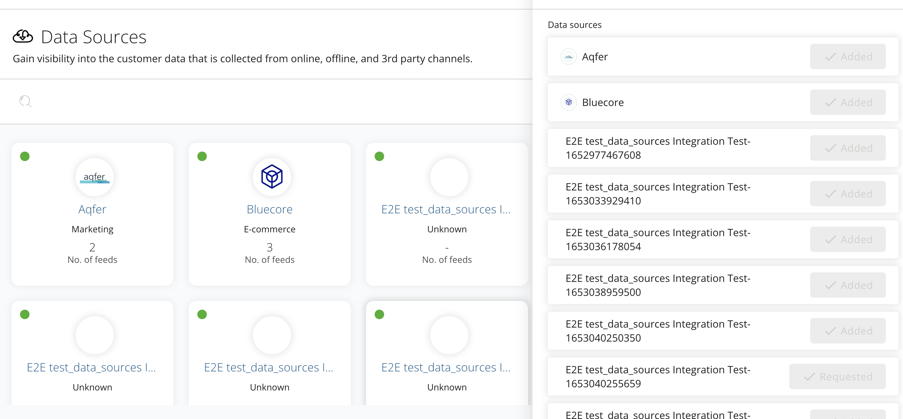
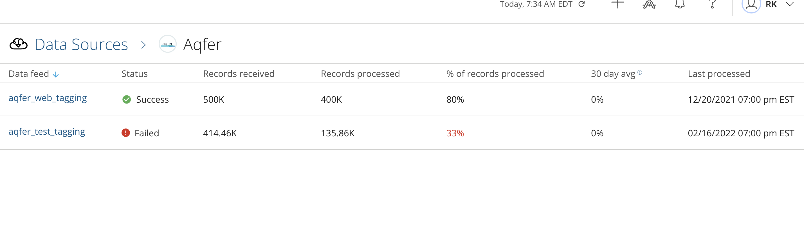
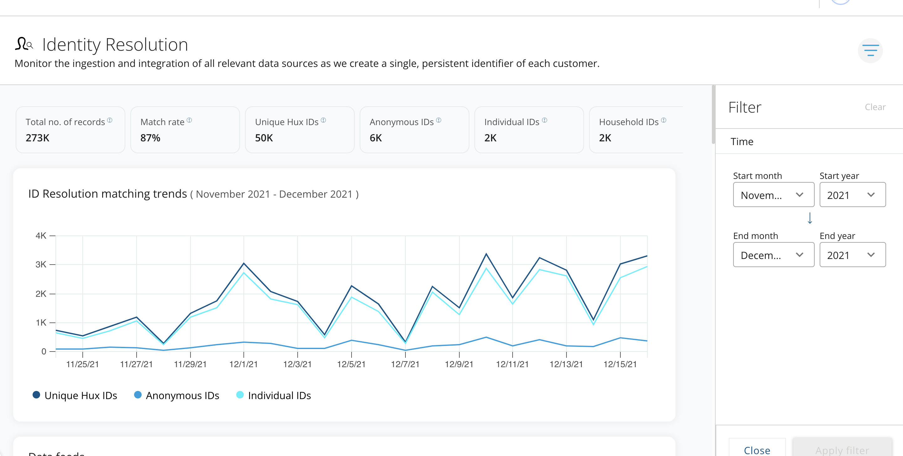

=============================================
Data Management
=============================================

This page is intended to detail how Data Management module works in Huxunify.

Data Sources
------------------------
This tab shows all the available data sources

For each data source, we can get the list of ingestion jobs processed along with status

Identity Resolution
-------------------
User can look at the IDR matching resolution trends with the ability to filter based on dates.

Data Load Frequency
-------------------

.. list-table:: Data Load Frequencies
   :widths: 20 20 20 20 20
   :header-rows: 1

   * - Components
     - Screens
     - Integration Tables
     - Frequency
     - Comments
   * - Data Sources
     - Aggregated at Data Sources
     - CONNECTION
     - 15 Minutes
     - HXP Data Catalog status for Data Source
   * - Data Sources
     - Aggregated at Data Feeds
     - CONNECTION_DETAILS
     - 15 Minutes
     -
   * - Data Sources
     - Aggregated at Data Files
     - CONNECTION_DETAILS
     - 15 Minutes
     -
   * - IDR Insights
     - IDR Insights
     - DATA_FEEDS
     - 15 Minutes
     -
   * - IDR Insights
     - IDR Chart
     - TBD
     - 15 Minutes
     - TBD
   * - IDR Insights
     - Matching Trends
     - DATA_FEEDS
     - 15 Minutes
     -
   * - IDR Insights
     - IDR Data Feeds
     - DATA_FEEDS
     - 15 Minutes
     -
   * - IDR Insights
     - IDR Data Feed's Waterfall Report
     - DATA_FEEDS
     - 15 Minutes
     -
   * - Customer Profile
     - Events
     - CUSTOMER_EVENTS
     - 24 Hours
     -
   * - Customer Profile
     - Customer Profiles
     - CUSTOMER_EVENTS
     - 24 Hours
     -
   * - Customer Profile
     - All Segments
     - CUSTOMER_EVENTS
     - 24 Hours
     -
   * - Notifications
     - IDR
     - Notification Push
     - Immediate
     -
   * - Notifications
     - DataSources
     - Notification Push
     - Immediate
     -

Ingestion Job Status
--------------------

.. list-table:: Ingestion Job Status
   :widths: 25 25 50
   :header-rows: 1

   * - STATUS
     - SUB-STATUS
     - Description
   * - Running or Started?
     - InProgress
     - File processing/job started and is in progress
   * - Running or Started?
     - Partial Success - InProgress
     - File processing started, at least one record loaded into LTD table and File processing/job is in progress
   * - Running or Started?
     - Waiting
     - File processing started and no active job running
   * - Running or Started?
     - Partial Success - Waiting
     - File processing started, at least one record loaded into LTD table and no active job running
   * - Success
     - Complete
     - File processing complete and all jobs are success
   * - Failed
     - InProgress
     - File processing/job is in progress and at least one job failed
   * - Failed
     - Partial Success - InProgress
     - File processing/job is in progress and at least one job failed with at least 1 record loaded into LTD Table
   * - Failed
     - Partial Success
     - File processing complete/waiting and at least one job failed with at least 1 record loaded into LTD Table
   * - Failed
     - Waiting
     - File processing complete/waiting and at least one job failed
   * - Failed
     - Failed
     - File processing failed at ingestion job
   * - Canceled
     - Canceled
     - If ingestion Job is cancelled
   * - Canceled
     - Waiting/All chunks cancelled
     - File processing complete/waiting and at least one job cancelled
   * - Canceled
     - Partial Success
     - File processing complete/waiting and at least one job cancelled with at least 1 record in LTD
   * - Canceled
     - Partial Success - InProgress
     - File processing/job is in progress and at least one job cancelled with at least 1 record in LTD
