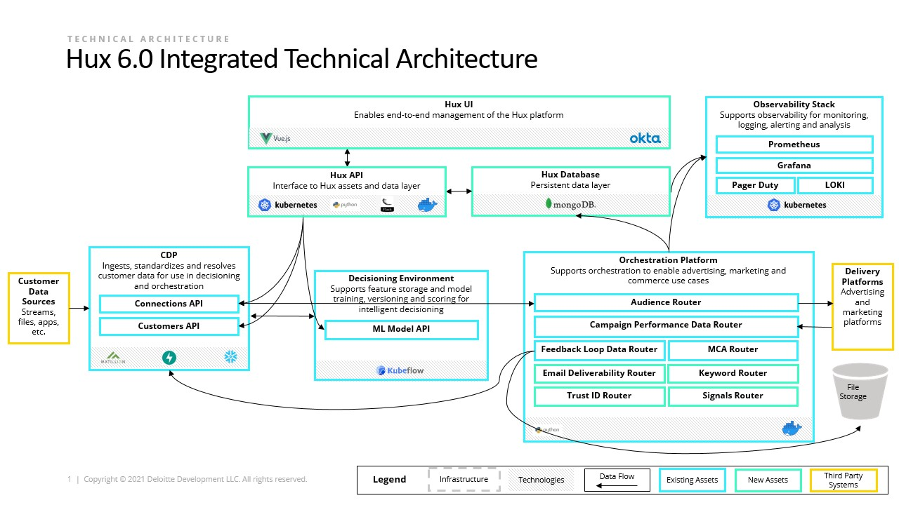
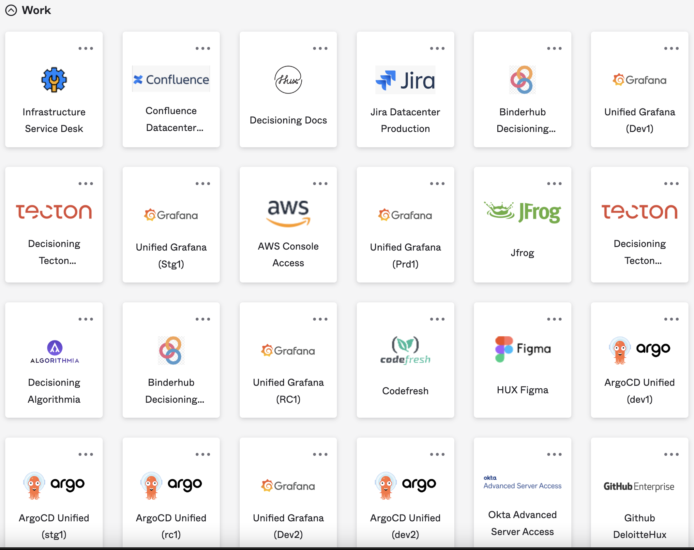

======================================
Getting Started - HUX-Unified Platform
======================================

This page is intended to help access the HUX Platform and its relevant applications like the backend API and frontend UI.

HUX Unified Architecture
------------------------
The below diagram depicts the overall architecture of HUX Unified Platform.

Requesting Access
-----------------
The first step to get access is to get an Okta account set up. Okta is a SSO(Single Sign On) service provider that is used with across Deloitte HUX to access a vast majority of applications.

Once the Okta account is setup, the list of available applications can be seen on the `Okta Dashboard <https://deloittedigital-ms.okta.com/app/UserHome>`_ or via the direct URLs of each individual applications like seen below.

.. note::
    If at any point there is a need to get access to an application, please do so by creating a infra ticket at Infrastructure Service Desk (deloitte.com) that can be accessed via the Okta dashboard.

Accessing HUX Unified Resources
-------------------------------
Connecting to a HUX environment requires a successful VPN connection to that particular environment in order to access the HUX applications(frontend & backend) and its resources. These application accesses will need to be appropriately provided to the Okta account.

******************
Setting up AWS VPN
******************
AWS Client VPN allows users to securely connect to services on AWS even if they are on private subnet. In this guide we assume AWS infrastructure for Client VPN endpoint has been set up. In order to access VPN endpoint you need to follow these steps:

- Download AWS Client VPN software from here if you don't have it already.
- Download the VPN configuration file:
    - `hux-unified-dev1.ovpn <https://confluence.hux.deloitte.com/download/attachments/98502219/hux-unified-dev1.ovpn?version=1&modificationDate=1635774883343&api=v2>`_
    - `hux-unified-stg1.ovpn <https://confluence.hux.deloitte.com/download/attachments/98502219/hux-unified-stg1.ovpn?version=1&modificationDate=1635774892495&api=v2>`_
    - `hux-unified-rc1.ovpn <https://confluence.hux.deloitte.com/download/attachments/98502219/hux-unified-rc1.ovpn?version=1&modificationDate=1635774892174&api=v2>`_
- Open the AWS Client VPN desktop app on your machine.
- In the top menu select File and Manage Profiles.
- Press Add Profile and point to the downloaded file. You can give it a Display Name of your choice. I suggest the environment name, e.g. hux-unified-dev-1.
- You should now see the profile in the list on the AWS Client VPN software. Select it and click Connect.
- During the connection process you will be redirected to your IdP for authentication (Okta). AWS Client VPN is using the default browser configured on your device,

Please refer to this `aws <https://confluence.hux.deloitte.com/display/TO/How-To%3A+Authenticate+to+AWS+console%2C+API%2C+terragrunt%2C+VPN+using+Okta+for+End+Users>`_ confluence page for more information about setting up and accessing AWS VPN client.

*************************************************
Connecting to a AWS VPN and HUX Unified Resources
*************************************************
- Open the AWS Client VPN software and select the appropriate profile and click Connect.
- A prompt for the Okta credentials to authenticate will pop-up.
- Using the URLs in the table below, connect to the appropriate HUX UI. Use Okta credentials as requested.

*************************************************
Connecting to Azure VPN and HUX Unified Resources
*************************************************
Please refer to this `azure <https://confluence.hux.deloitte.com/display/HUS/Azure+Environment+Access>`_ confluence page for more information about setting up and accessing an HUX environment set up on Azure VPN client.

************
Environments
************
.. list-table:: AWS Environments
   :widths: 12 22 22 22 22
   :header-rows: 1

   * - Component
     - Dev
     - Stage
     - RC1
     - Prod
   * - Hux Unified UI
     - `<https://unified-ui-dev.main.use1.hux-unified-dev1.in/>`_
     - `<https://unified-ui.main.use1.hux-unified-stg1.in/>`_
     - `<https://unified-ui.main.use1.hux-unified-rc1.in/>`_
     - --
   * - Hux Unified API
     - `<https://unified-api-dev.main.use1.hux-unified-dev1.in/api/v1/ui/>`_
     - `<https://unified-api.main.use1.hux-unified-stg1.in/api/v1/ui/>`_
     - `<https://unified-api.main.use1.hux-unified-rc1.in/api/v1/ui/>`_
     - --
   * - Argo CD
     - `<https://argocd.hux-unified-dev1.in/>`_
     - `<https://argocd.main.use1.hux-unified-stg1.in/>`_
     - `<https://argocd.main.use1.hux-unified-rc1.in/>`_
     - --
   * - Customer API
     - `<https://customer-profile-api.main.use1.hux-unified-dev1.in/docs#/>`_
     - `<https://customer-profile-api.main.use1.hux-unified-stg1.in/docs#/>`_
     - `<https://customer-profile-api.main.use1.hux-unified-rc1.in/docs#/>`_
     - --
   * - Connections API
     - `<https://connections-api.main.use1.hux-unified-dev1.in/docs#/>`_
     - `<https://connections-api.main.use1.hux-unified-stg1.in/docs#/>`_
     - `<https://connections-api.main.use1.hux-unified-rc1.in/docs#/>`_
     - --

.. list-table:: Azure Environments
   :widths: 12 22 22 22 22
   :header-rows: 1

   * - Component
     - Dev
     - Stage
     - RC1
     - Prod
   * - Hux Unified UI
     - `<https://unified-ui-dev.main.use2.hux-husdev2.in/>`_
     - --
     - --
     - --
   * - Hux Unified API
     - `<https://unified-api-dev.main.use2.hux-husdev2.in/api/v1/ui/>`_
     - --
     - --
     - --
   * - Argo CD
     - `<https://argocd.hux-husdev2.in/>`_
     - --
     - --
     - --
   * - Customer API
     - `<https://customer-profile-api.main.use2.hux-husdev2.in/docs>`_
     - --
     - --
     - --
   * - Connections API
     - `<https://connections-api.main.use2.hux-husdev2.in/docs>`_
     - --
     - --
     - --

**********
Monitoring
**********
A monitoring dashboard is accessible on each of the available environment using the below URL. The monitoring interface is a typical `Grafana <https://grafana.com/>`_ UI.

.. list-table:: AWS Environment
   :widths: 12 22 22 22 22
   :header-rows: 1

   * - Component
     - Dev
     - Stage
     - RC1
     - Prod
   * - Grafana
     - `<https://grafana.huxui-main-use1-unified-dev1.hux-unified-dev1.in/>`_
     - `<https://grafana.hux-unified-stg1.in/>`_
     - `<https://grafana.hux-unified-rc1.in/>`_
     - --

.. list-table:: Azure Environment
   :widths: 12 22 22 22 22
   :header-rows: 1

   * - Component
     - Dev
     - Stage
     - RC1
     - Prod
   * - Grafana
     - --
     - --
     - --
     - --
