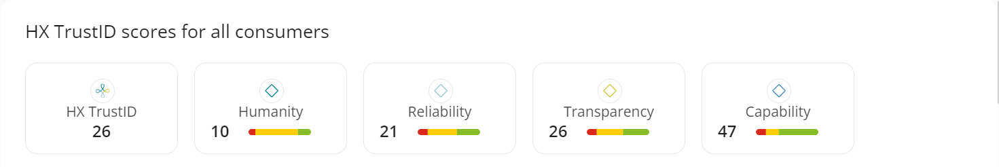
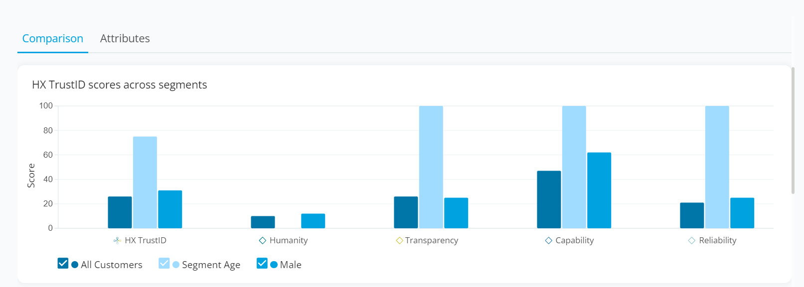
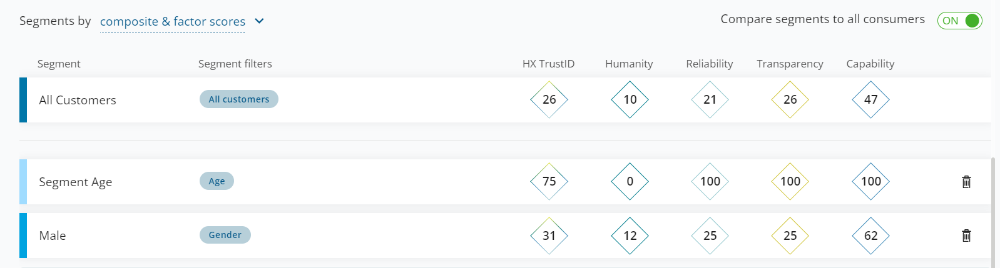
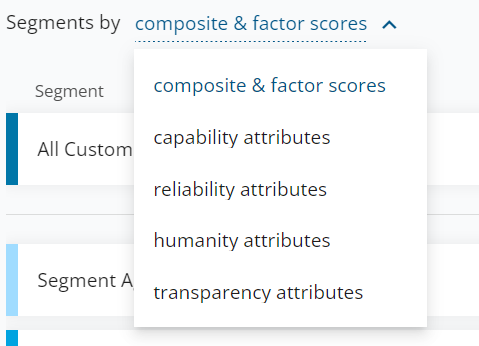
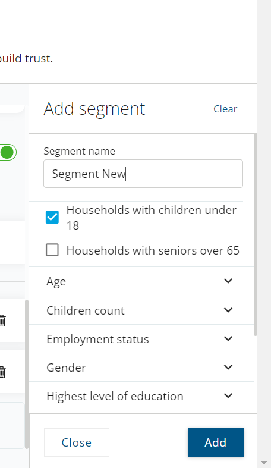
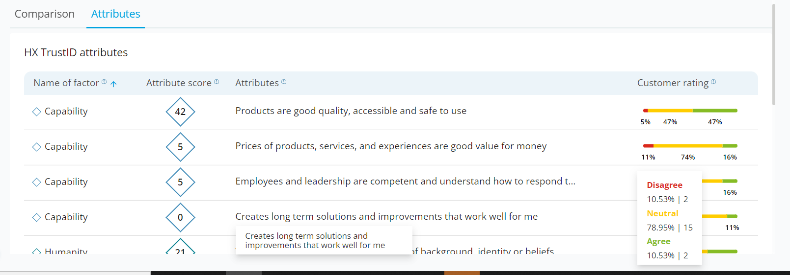

=============================================
TrustID
=============================================

This page is intended to detail features and workings of TrustID module in Huxunify.

TrustID helps measure the factors of trust, predict how trust sentiment will impact consumer & employee behaviors,
and identify actions to (re)build trust.

TrustID Overview
------------------------
This section shows the overall aggregated trust score and the individual factor scores for all survey responses.

Hovering over each factor card gives a detailed breakup of the categorised(positive, neutral, negative)
survey responses.

TrustID Comparison
-------------------
The TrustID comparison section lets the user compare factor and attribute scores across various segments.

Factor scores comparison.

Attribute scores comparison.

The user can add custom segments by clicking **New segment to compare** and selecting the required filters.

TrustID Attributes
-------------------
This section shows the aggregated scores of attributes across all surveys. In addition detailed customer rating
information can be found on hovering over the progress stack bar.

