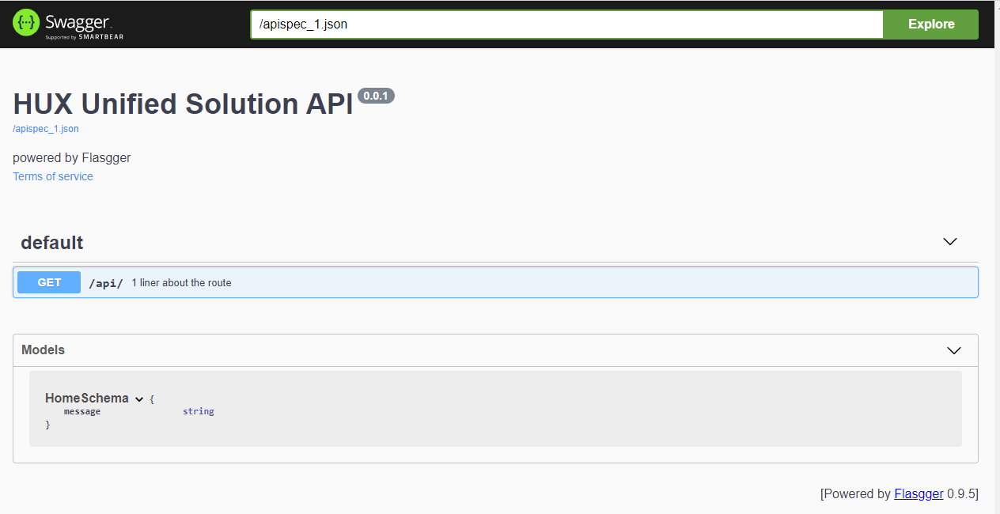

# Hux Unified API

[]( https://g.codefresh.io/pipelines/edit/new/builds?id=605a45789f86ae45939bfec3&pipeline=unified_solution_api_ci&projects=Hux_Unified_Solution&projectId=605a4546bfffd0aea1e243a0)

Hux Unified API is an API that will be primarily consumed by the
Hux Unified Front-end application.

The API is UI-driven.

* [Hux Unified API](#hux-unified-api)
   * [Installation](#installation)
      * [Load custom artifacts](#load-custom-artifacts)
   * [Environment Variables](#environment-variables)
      * [Setup](#setup)
      * [Connecting to the UNIFIED Environment.](#connecting-to-the-unified-environment)
      * [Generating AWS Credentials](#generating-aws-credentials)
         * [saml2aws Setup Tips](#saml2aws-setup-tips)
            * [Chocolatey (Tips applicable only to Windows)](#chocolatey-tips-applicable-only-to-windows)
            * [saml2aws (Windows and Mac)](#saml2aws-windows-and-mac)
      * [Software Dependencies](#software-dependencies)
         * [Flasgger](#flasgger)
         * [flask-marshmallow](#flask-marshmallow)
         * [apispec](#apispec)
      * [Docker](#docker)
   * [Deployment](#deployment)
   * [Usage](#usage)
   * [Style Guide](#style-guide)
      * [pylint](#pylint)
         * [Visual Studio Code](#visual-studio-code)
         * [PyCharm](#pycharm)
      * [Black](#black)
         * [PyCharm](#pycharm-1)
         * [Visual Studio Code](#visual-studio-code-1)
      * [MYPY](#mypy)
         * [PyCharm](#pycharm-2)
         * [Visual Studio Code](#visual-studio-code-2)
      * [Docstrings](#docstrings)
      * [Typehinting and Docstrings](#typehinting-and-docstrings)
      * [Testing](#testing)
   * [Database](#database)
      * [Connection to the database](#connection-to-the-database)
      * [Local MongoDB Setup](#local-mongodb-setup)
      * [How to implement a new endpoint](#how-to-implement-a-new-endpoint)


## Installation
```
# clone the repo
git clone https://github.com/DeloitteHux/hux-unified.git

# cd to the hux/api repo
cd hux-unified/hux/api

# install pipenv
pip install pipenv
```

### Load custom artifacts
Follow the below steps to get the custom artifactory set to session path
1. Access JFrog via Okta Dashboard
2. On JFrog page - click on "Edit Profile" by selecting account name on top right
3. Generate a new API Key under "Authentication Settings" and copy it
4. Proceed with the following commands

```
# set custom artifactory
set ARTIFACTORY_PYTHON_READ=https://<OKTA_USER_NAME>@deloitte.com:<GENERATED_JFROG_API_KEY>@repo.mgnt.in/artifactory/api/pypi/python/simple

# run pipenv install
pipenv install

# activate the virtual environment
pipenv shell
```

## Environment Variables
The API consumes environment variables from the settings.ini file.
For more information, see the link below.
https://github.com/henriquebastos/python-decouple

Decouple always searches for Options in this order:
1. Environment variables
2. Repository: ini or .env file
3. Default argument passed to config

### Setup

```
# cd to the hux/api folder
cd hux-unified/hux/api

# download the public ssl cert for aws
wget https://s3.amazonaws.com/rds-downloads/rds-combined-ca-bundle.pem

# copy the template-settings.ini file
cp template-settings.ini settings.ini

# now populate all the env variables in that file.
```

### Connecting to the UNIFIED Environment.
A user must be connected to the AWS VPN for accessing the database and unified domains.
Instructions for connection can be followed here
 - [AWS Client VPN](https://confluence.hux.deloitte.com/pages/viewpage.action?spaceKey=TO&title=How-To%3A+Authenticate+to+AWS+console%2C+API%2C+terragrunt%2C+VPN+using+Okta+for+End+Users#HowTo:AuthenticatetoAWSconsole,API,terragrunt,VPNusingOktaforEndUsers-AWSClientVPNapp)

### Generating AWS Credentials
For connecting to AWS, a user must generate AWS credentials via OKTA.
Instructions can be found here
 - [Accessing AWS Console](https://confluence.hux.deloitte.com/pages/viewpage.action?spaceKey=TO&title=How-To%3A+Authenticate+to+AWS+console%2C+API%2C+terragrunt%2C+VPN+using+Okta+for+End+Users#HowTo:AuthenticatetoAWSconsole,API,terragrunt,VPNusingOktaforEndUsers-AWSConsoleAccessapp)

### saml2aws Setup Tips
Following are some useful tips to take into consideration for installing **"chocolatey"** and **"saml2aws"**.

#### Chocolatey (Tips applicable only to Windows)
1. Try the installation method mentioned as "Administrative Installation" as a first option as described at [Chocolatey Administrative Installation](https://chocolatey.org/install)
2. Ensure to perform this on Powershell open with elevated administrative privileges
3. It is important to open and close the Powershell window as needed after executing each command to avoid incorrect errors during validation of installation
4. If there are any errors/issues observed during "Administrative Installation", then fallback to "Non-Administrative Installation" as described in [Chocolatey Non-Administrative Installation](https://docs.chocolatey.org/en-us/choco/setup#non-administrative-install)

#### saml2aws (Windows and Mac)
1. When configuring a saml2aws profile mentioned here in this [page](https://confluence.hux.deloitte.com/pages/viewpage.action?spaceKey=TO&title=How-To%3A+Authenticate+to+AWS+console%2C+API%2C+terragrunt%2C+VPN+using+Okta+for+End+Users#HowTo:AuthenticatetoAWSconsole,API,terragrunt,VPNusingOktaforEndUsers-saml2aws), select **"PUSH"** option for **"MFA"** in order to receive push notification on the MFA method that is enabled. This will help in not having to enter the 6 digits authenticator code everytime.
2. Choosing **"PUSH"** for **"MFA"** while configuring the saml2aws profile will show the below snippet in cmd prompt.
```
Please choose a provider: Okta
Please choose an MFA: PUSH
AWS Profile: aws_profile
URL: https://deloittedigital-ms.okta.com/home/amazon_aws/0oa8wpt9wly7Pf3gm2p7/272
Username: <your_Okta_username>
Password: <your_Okta_password>
Confirm: <your_password>
```
3. This MFA method can also be modified at a later time too as needed in **C:\Users\<WINDOWS_USER>\.saml2aws** file. Notice the value for **"mfa"** to be set to **"PUSH"**.
```
[okta_provider]
name                    = [okta_provider]
app_id                  =
url                     = https://deloittedigital-ms.okta.com/home/amazon_aws/0oa8wpt9wly7Pf3gm2p7/272
username                = <your_Okta_username>
provider                = Okta
mfa                     = PUSH
skip_verify             = false
timeout                 = 0
aws_urn                 = urn:amazon:webservices
aws_session_duration    = 3600
aws_profile             = aws_profile
resource_id             =
subdomain               =
role_arn                =
region                  =
http_attempts_count     =
http_retry_delay        =
credentials_file        =
saml_cache              = false
saml_cache_file         =
target_url              =
disable_remember_device = false
disable_sessions        = false
```

### Software Dependencies

Python Version
* Python 3.7

#### Flasgger
Flasgger is a Flask extension to **extract [OpenAPI-Specification](https://github.com/OAI/OpenAPI-Specification/blob/master/versions/2.0.md#operation-object)**
from all Flask views registered in your API.

Flasgger also comes with **[SwaggerUI](http://swagger.io/swagger-ui/) embedded** so you can access [http://localhost:5000/apidocs](localhost:5000/apidocs)
and visualize and interact with your API resources.

#### flask-marshmallow

Flask-Marshmallow is a thin integration layer for **[Flask](http://flask.pocoo.org/)** (a Python web framework)
and **[marshmallow](http://marshmallow.readthedocs.io/)** (an object serialization/deserialization library)
that adds additional features to marshmallow, including URL and Hyperlinks fields for HATEOAS-ready APIs.
It also (optionally) integrates with **[Flask-SQLAlchemy](http://marshmallow.readthedocs.io/)**.

#### apispec

apispec is a pluggable API specification generator. Currently, supports the **extract [OpenAPI-Specification](https://github.com/OAI/OpenAPI-Specification/blob/master/versions/2.0.md#operation-object)**

### Docker
For building the docker locally, follow the steps below
```
# starting from the parent folder of the repo
# assumes docker is installed

# pull python3.7-slim-buster
docker pull python@sha256:5375725c3c0a0215279c1c5ddb33f91d31f0eb37010140397e5c7e5530073d2c

# change the repo line in hux/api/Dockerfile to the following.
FROM python:3.7-slim-buster AS hux-unified

# build the docker
sudo docker build . -f ./hux/api/Dockerfile --build-arg ARTIFACTORY_PYTHON_READ=https://{user_name@deloitte.com}:{jfrog_key}@repo.mgnt.in/artifactory/api/pypi/python/simple --tag hux-unifed-test

# after it is built, run it to test
sudo docker run -p 5000 hux-unifed-test
```

## Deployment
The API deployment is currently managed by the TechOps team.
The steps to deploying to each environment are as follows

### CD/Codefresh Configuration
The CI/CD process for the API is located [here](https://g.codefresh.io/pipelines/edit/workflow?id=605a45789f86ae45939bfec3&pipeline=unified_solution_api_ci&projects=Hux_Unified_Solution&projectId=605a4546bfffd0aea1e243a0&rightbar=steps&context=DeloitteHux_github) in Codefresh.

The process is driven by the YAML file [hux/api/ci/codefresh-api.yml](https://github.com/DeloitteHux/hux-unified/blob/main/hux/api/ci/codefresh-api.yml#L151).

### Deployment Environment Variables
Each environment will have different environment variables configured.
The environment variables are stored and managed in the TechOps repository located [here](https://github.com/DeloitteHux/hux-unified-deploy/blob/main)

**Environment**|**Instructions**|**Values File**
:-----:|:-----:|:-----:
DEV1| Automatically on Merge to Main|[values-huxui-main-use1-unified-dev1.yaml](https://github.com/DeloitteHux/hux-unified-deploy/blob/main/unified-api/k8s/charts/values-huxui-main-use1-unified-dev1.yaml)
STG1| Automatically on Merge to Main|[values-huxui-main-use1-unified-stg1.yaml](https://github.com/DeloitteHux/hux-unified-deploy/blob/main/unified-api/k8s/charts/values-huxui-main-use1-unified-stg1.yaml)
RC1| Creating a git release [HERE](https://github.com/DeloitteHux/hux-unified/releases/new) with the tag pattern of `app-v#.#.#`|[values-huxui-main-use1-unified-rc1.yaml](https://github.com/DeloitteHux/hux-unified-deploy/blob/main/unified-api/k8s/charts/values-huxui-main-use1-unified-rc1.yaml)

PRD| |Coming Soon

#### Example
```
OKTA_CLIENT_ID: 0oab1i3ldgYyRvk5r2p7
OKTA_ISSUER: https://deloittedigital-ms.okta.com
CDP_SERVICE: https://customer-profile-api.main.use1.hux-unified-dev1.in
```

### RC1 Deployment


## Usage

Here's an example of basic usage
```
# cd to the hux/api folder
cd hux-unified/hux/api

# add the current directory to python path
PYTHONPATH=$PYTHONPATH:`pwd`

# run the flask app
python huxunify/app.py
```

API Usage
 - SWAGGER DOCS: http://0.0.0.0:5000/api/v1/ui
 - HEALTH CHECK: http://0.0.0.0:5000/health-check




## Style Guide

### pylint
We use a series of pylint checks for this project.
They can be found [here](https://github.com/DeloitteHux/hux-unified/blob/main/.pylintrc)

pylint can be configured within your IDE.
Here is how to configure for the common IDEs:

#### Visual Studio Code
https://code.visualstudio.com/docs/python/linting

#### PyCharm
https://www.jetbrains.com/help/pycharm/configuring-third-party-tools.html
https://plugins.jetbrains.com/plugin/11084-pylint

### Black
python Black enforces formatting, for more information see the black [homepage](https://black.readthedocs.io/en/stable/installation_and_usage.html)
We configure Black within our project by using pyproject.toml files.

With IDE integration, a user can configure black so that it automatically runs on file save.

Here is how to configure for the common IDEs:

#### PyCharm
https://black.readthedocs.io/en/stable/editor_integration.html#pycharm-intellij-idea

#### Visual Studio Code
https://black.readthedocs.io/en/stable/editor_integration.html#visual-studio-code

 ### MYPY
Mypy is an optional static type checker for Python. You can add type hints (PEP 484) to your Python programs,
and use mypy to type check them statically. Find bugs in your programs without even running them!

#### PyCharm
https://github.com/dropbox/mypy-PyCharm-plugin

#### Visual Studio Code
https://code.visualstudio.com/docs/python/linting#_mypy

### Docstrings
Google Python Docstrings
https://sphinxcontrib-napoleon.readthedocs.io/en/latest/example_google.html

Example of the docstring format we are following which contains the following
 - description
 - args
     - arg name (arg type): arg description.
 - returns
     - return type: description of the return value.
```
def generate_synthetic_marshmallow_data(schema_obj: Schema) -> dict:
    """This function generates synthetic data for marshmallow

    Args:
        schema_obj (Schema): a marshmallow schema object

    Returns:
        dict: a dictionary that simulates the passed in marshmallow schema obj

    """
    # get random data based on marshmallow type
    return {
        field: SPEC_TYPE_LOOKUP[type(val)] for field, val in schema_obj().fields.items()
    }
```

### Typehinting and Docstrings
```
def generate_synthetic_marshmallow_data(schema_obj: Schema) -> dict:
    """This function generates synthetic data for marshmallow

    Args:
        schema_obj (Schema): a marshmallow schema object

    Returns:
        dict: a dictionary that simulates the passed in marshmallow schema obj

    """
    # get random data based on marshmallow type
    return {
        field: SPEC_TYPE_LOOKUP[type(val)] for field, val in schema_obj().fields.items()
    }
```

### Testing
```
# cd to the hux/api folder
cd hux-unified/hux/api

# add current directory to python path
PYTHONPATH=$PYTHONPATH:`pwd`

# run the unit tests with unittest
# set FLASK_ENV environment variable
# Windows
set FLASK_ENV=pytest
# Mac/Linux
export FLASK_ENV=pytest
# run tests
python -m unittest

# run the unit tests with pytest
# run tests
python -m pytest
```

## Database
Huxunify connects to a DocumentDB via [pymongo](https://pymongo.readthedocs.io/en/stable/index.html)

### Connection to the database
There are two primary ways for connecting to the database

1. Using the command line - instructions [here](https://docs.mongodb.com/manual/mongo/#:~:text=You%20can%20use%20the%20command-line%20option%20--host%20%3Chost%3E%3A%3Cport%3E.,the%20--host%20%3Chost%3E%20and%20--port%20%3Cport%3E%20command-line%20options.)
2. Using a GUI such as MongoDB Compass [here](https://www.mongodb.com/products/compass)


### Local MongoDB Setup
MongoDB Installation Steps
* Download [MongoDB Community Server v3.6](https://fastdl.mongodb.org/win32/mongodb-win32-x86_64-2008plus-ssl-3.6.23-signed.msi)
* To install MongoDB on local machine follow the instructions [here](https://docs.mongodb.com/v3.6/installation/)

Steps to pre-populate use local MongoDB

* Follow the steps in [/scripts/database/README.md](https://github.com/DeloitteHux/hux-unified/blob/main/scripts/database/README.md) to build huxunifylib-database package
* Ensure to set the MONGO env variables in [/scripts/database/README.md](https://github.com/DeloitteHux/hux-unified/blob/main/scripts/database/README.md) before you execute any of the scripts using the following commands
  ```
  # Windows Command Prompt
  set MONGO_DB_HOST=localhost
  set MONGO_DB_PORT=27017
  set MONGO_DB_USERNAME=''
  set MONGO_DB_PASSWORD=''
  set MONGO_DB_USE_SSL=False
  ```
  ```
  # MACOS/Linux Terminal Command
  export MONGO_DB_HOST=localhost
  export MONGO_DB_PORT=27017
  export MONGO_DB_USERNAME=''
  export MONGO_DB_PASSWORD=''
  export MONGO_DB_USE_SSL=False
  ```


* Follow the steps in [/scripts/database/README.md](https://github.com/DeloitteHux/hux-unified/blob/main/scripts/database/README.md) to populate the data in your local database

To use local database for development, set the following in `../../hux/api/settings.ini`.
   ```
   MONGO_DB_HOST=localhost
   MONGO_DB_PORT=27017
   MONGO_DB_USERNAME=''
   MONGO_DB_PASSWORD=''
   MONGO_DB_USE_SSL=False
   ```

### How to implement a new endpoint
* Define marshmallow Schema: create a schema by defining a class with variables
mapping attribute names to Field objects. For example:
```
class Fieldmapping(Schema):
    """Fieldmapping schema."""

    field_id = Int(required=True)
    field_name = Str(required=True, validate=validate.OneOf(FIELD_NAMES))
    field_variation = Str(required=True)
    modified = DateTime(required=True)
```

* Add swagger view to route
1. Setup the blueprint, for example:
```
cdm_bp = Blueprint("cdm", import_name=__name__)
```

2. Add view to blueprint, for example:
```
@add_view_to_blueprint(
    cdm_bp, f"/{FIELDMAPPINGS_ENDPOINT}/<field_id>", "FieldmappingView"
)
```

3. Add parameters and responses of the endpoint, for example:
```
    parameters = [
        {
            "name": "field_id",
            "description": "ID of the fieldmapping",
            "type": "integer",
            "in": "path",
            "required": "true",
        }
    ]
    responses = {
        HTTPStatus.OK.value: {
            "schema": Fieldmapping,
        },
        HTTPStatus.NOT_FOUND.value: {
            "schema": NotFoundError,
        },
    }
```

4. Add marshal_with(Schema) to the method, for example:
```
@marshal_with(Fieldmapping)
```

5. Add Endpoint Summary and Description

Flasgger uses view functions docstrings to fill the summary and description
The part of the docstring following the '---' line is ignored.

The part before the '---' line is used as summary and description.
The first lines are used as summary.
If an empty line is met, all following lines are used as description.

```
def get(...):
    """Retrieves the processed data source catalog.

    Return processed data sources
    ---
    Returns:
        Response: List of processed data sources.
    """
```

The example above produces the following documentation attributes:
```
{
    'get': {
        'summary': 'Retrieves the processed data source catalog.',
        'description': 'Return processed data sources',
    }
}
```

6. Here is an example of a completed endpoint.
```
@add_view_to_blueprint(cdm_bp, f"/{PROCESSED_DATA_ENDPOINT}", "ProcessedDataSearch")
class ProcessedDataSearch(SwaggerView):
    """
    ProcessedData search class
    """

    parameters = []
    responses = {
        HTTPStatus.OK.value: {
            "description": "List of processed data sources.",
            "schema": ProcessedData,
        }
    }
    tags = [PROCESSED_DATA_TAG]

    @marshal_with(ProcessedData(many=True))
    def get(self):  # pylint: disable=no-self-use
        """Retrieves the processed data source catalog.

        Return processed data sources
        ---
        Returns:
            Response: List of processed data sources.
        """
        return CdmModel().read_processed_sources(), HTTPStatus.OK.value
```
