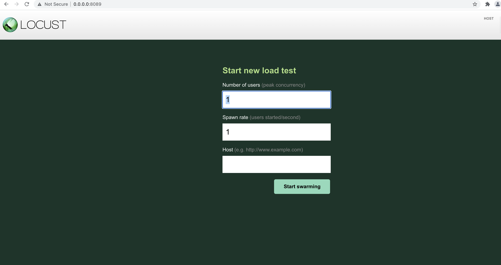

# Load Tests
Manage and run load tests for HUX API. This load test will effectively swarm the HUX API with multiple requests and multiple users.

## Framework
For this load test, we will be using Locust.IO
https://locust.io/

Locust is an open source load test tool designed to swarm systems.


## Running load tests locally
```
# cd to this folder
cd ./hux/load_tests

# run locust
locust

# open the url
http://0.0.0.0:8089/
```

Once in the URL, enter the amount of spawned users, and website url.

